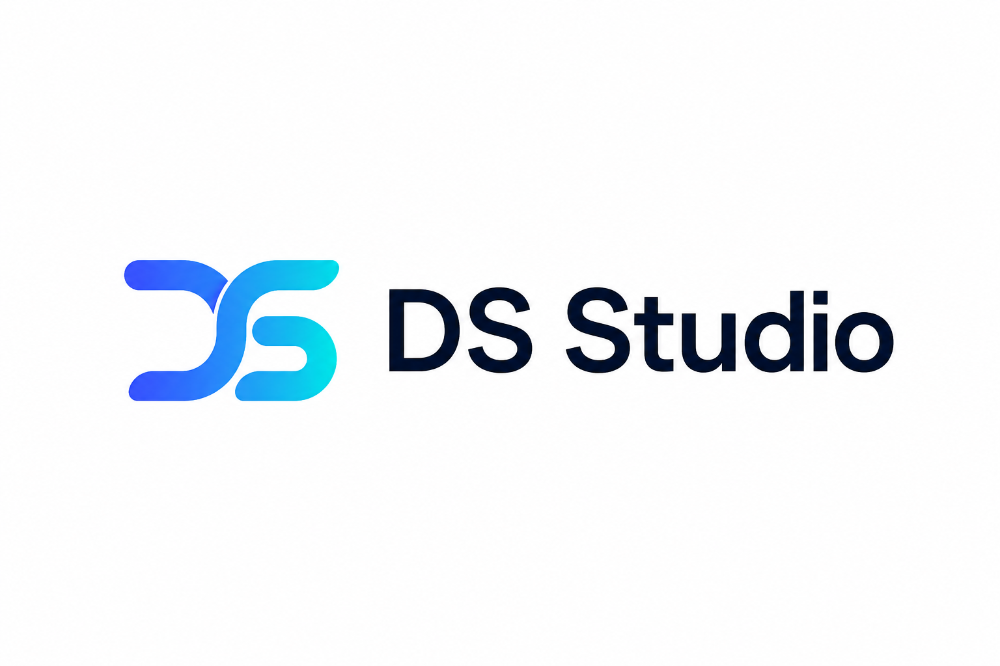

<p align="center">
  
</p>

<p align="center">
  面向 Windows 的开箱即用 AI Harness 桌面工作台。<br>
  内置 DeepSeek Harness 官方 Web 体验，同时自由连接国内外模型、本地模型与 OpenAI Compatible 服务。
</p>

<p align="center">
  <strong>v0.1.2</strong> · Windows 11 x64 · MIT<br><br>
  <a href="https://github.com/vayneluo/dsh-studio/releases/download/v0.1.2/dsh-studio_0.1.2_x64-setup.exe"><strong>下载 Windows 安装包</strong></a>
  ·
  <a href="https://github.com/vayneluo/dsh-studio/releases/tag/v0.1.2">查看发行说明</a>
</p>

## DS Studio 是什么


DS Studio 将 [DeepSeek Harness](https://github.com/deepseek-ai/deepseek-harness) 的官方 Web 工作流封装成独立 Windows 桌面应用。安装后直接启动，无需另外安装 Node.js、配置命令行或手动维护后台进程。

它保留 Harness 的插件化能力和 Models 配置逻辑，同时提供不绑定单一厂商的首次模型服务引导。你可以从国内外云模型、本地 Ollama，或者任意 OpenAI Compatible 接口开始使用。

<br clear="right">

## 产品能力

- **Windows 桌面体验**：Tauri 管理窗口、后台 Host、动态端口和退出清理。
- **多模型服务引导**：支持 DeepSeek、百炼、火山方舟、智谱、OpenAI、Anthropic、Gemini、OpenRouter、Ollama 与 OpenAI Compatible。
- **自定义兼容接口**：支持 Base URL、API Key、协议选择、模型发现和手动模型名称。
- **离线默认插件**：全新安装预置 5 个固定版本插件，首次启动无需联网下载插件。
- **本机访问边界**：Host 仅监听 `127.0.0.1`，端口由桌面应用动态分配。
- **用户数据保护**：升级不会覆盖已有 profile、设置、凭据、会话和自行安装的插件。

## 安装与首次使用

1. 从 [v0.1.2 Release](https://github.com/vayneluo/dsh-studio/releases/tag/v0.1.2) 下载 `dsh-studio_0.1.2_x64-setup.exe`。
2. 在 Windows 11 x64 上运行安装程序并启动 DS Studio。
3. 在首次引导中选择模型服务商；也可以明确跳过，之后前往“设置 → 模型”配置。
4. OpenAI Compatible 用户填写 Base URL、API Key 与协议后，可获取模型列表或手动添加模型。

终端用户无需安装 Node.js、Rust 或 Tauri。以上工具只用于源码构建。

## 支持的模型服务

| 类型 | 服务 |
| --- | --- |
| 国内云模型 | DeepSeek、阿里云百炼、火山方舟、智谱 AI |
| 国际云模型 | OpenAI、Anthropic、Google Gemini、OpenRouter |
| 本地模型 | Ollama，默认兼容地址 `http://127.0.0.1:11434/v1` |
| 自定义服务 | 任意提供 OpenAI Compatible Base URL、API Key 和模型接口的服务 |

模型服务向导只负责选择与引导，实际配置继续复用 Harness Models 的编辑器、校验、模型发现和凭据写入能力。

## 内置插件

全新安装且 `profiles/web` 完全不存在时，DS Studio 会离线播种以下固定版本插件：

| 插件 | 版本 |
| --- | --- |
| `dsh-at-file` | 0.6.0 |
| `@liustack/modlens` | 3.16.6 |
| `dsh-better-sidebar` | 0.12.1 |
| `dshmarket` | 1.2.2 |
| `dsh-message-edit` | 0.2.1 |

已有 profile 不补装、不覆盖；插件播种后立即生效，无需重启。应用不包含此前移除的 `@linxin666` 增强 UI、皮肤或 SSH 集成。

## 桌面运行方式

```text
DS Studio（Tauri 桌面壳）
  ├─ 内置 Node.js
  ├─ 内置 @deepseek-ai/dsh Host
  ├─ 官方 DSH Web profile
  └─ 本地应用数据：设置、凭据、会话、工作区与日志
```

启动页会立即显示；后台 Host 返回成功的 HTTP 响应后再进入 DSH Web。Host 只监听动态分配的 `127.0.0.1` 端口，退出应用时会终止 sidecar 及其子进程树。运行日志写入应用数据目录中的 `dsh-host.log`。

## 数据与隐私

- Host 仅监听 `127.0.0.1`，不会主动开放局域网或公网访问。
- 凭据、会话、设置和工作区状态保存在 Tauri 应用数据目录。
- API Key 通过 Harness credentials API 写入，不会以明文进入 `settings.yaml`，引导也不会读取或输出密钥。
- 明确跳过模型服务引导后会持久记录状态；以后仍可在“设置 → 模型”中配置。
- 升级不会覆盖已有 profile、用户插件或工作区数据。
- 模型调用、模型发现和市场浏览等在线功能仍取决于网络与对应服务可用性。

仅当 `profiles/web` 完全不存在时，应用才会在启动 Host 前从 EXE 内置资源原子播种默认 profile。任何已有 `profiles/web`，包括升级安装或卸载后保留数据的重装，都会直接跳过播种。

## 开发与构建

构建环境：Windows 11 x64、Rust stable、Tauri CLI 2.x、Node.js 24、curl 与 PowerShell。

```powershell
# 下载、安装并裁剪官方 DSH runtime
node scripts/bundle-host.mjs

# 完整测试与 smoke
node --test scripts/*.test.mjs
node scripts/smoke-test.mjs
$env:DSH_SMOKE_USE_SEED = '1'
node scripts/smoke-test.mjs
Remove-Item Env:DSH_SMOKE_USE_SEED
cargo test --manifest-path src-tauri/Cargo.toml

# 打开开发窗口
Push-Location src-tauri
cargo tauri dev
Pop-Location

# 生成 NSIS 安装包
Push-Location src-tauri
cargo tauri build
Pop-Location
```

默认 profile seed、完整 runtime 与 NSIS 安装包的硬门禁分别为 35 MiB、260 MiB、70 MiB。Windows x64 runtime 会在构建时剔除调试符号、source map、类型声明和非目标平台原生产物。

## 模型服务引导

OpenAI Compatible 支持可编辑 Base URL、API Key、协议、“获取模型”和手动模型名称。明确选择“跳过，稍后配置”后，`ui-onboarding.providerSetupVersion` 会记录当前引导版本，重启不会重复弹出。

厂商识别标记使用本地文本 monogram 和主题色，不加载远程图标、字体、脚本或跟踪资源。第三方名称和商标归各自权利人所有，详见 [`THIRD_PARTY_NOTICES.md`](./overrides/provider-onboarding/THIRD_PARTY_NOTICES.md)。

## Runtime override 维护边界

[`scripts/provider-onboarding-override.mjs`](./scripts/provider-onboarding-override.mjs) 固定针对 DeepSeek Harness `0.1.0-rc.6` 的编译产物。构建会校验目标包版本和源码锚点；上游版本或 bundle 结构漂移时主动失败，升级 Harness 时必须显式移植或移除 override。

忽略目录中的 `runtime/` 只用于本地运行与验证，不是实现来源。可维护源码位于 [`overrides/provider-onboarding/`](./overrides/provider-onboarding/) 和 [`scripts/provider-onboarding-override.mjs`](./scripts/provider-onboarding-override.mjs)。

## 许可

本项目代码采用 MIT 许可；DeepSeek Harness 按其上游许可分发。
